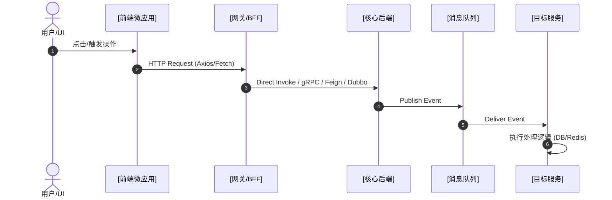

# Full-Stack Business Fault Analysis & Tracing Skill (`man-system`)

Use this skill to diagnose cross-layer business issues, trace data flow from frontend UI components down to backend microservices/MQ, or initialize/update the workspace service architecture map.

---

## 🎯 Intent & Command Dispatcher

- **Indexing / Init Mode**:
  - **Triggers**: User mentions "init", "update", "scan", "rebuild", "扫描微服务", "生成/更新服务地图", or runs `/man-system init`.
  - 👉 Jump to **[🛠️ Init / Indexing Mode]**.
- **Cross-Layer Analysis Mode**:
  - **Triggers**: User asks about business anomalies (e.g., *"点击提交按钮后页面无响应"*, *"从前端点击发货到后端执行经历了哪些服务？"*, *"排查订单支付后的异步 MQ 消费链路"*).
  - 👉 Execute the **[🔬 5-Phase Full-Stack Analysis SOP]**.

---

## 🛠️ [Init / Indexing Mode]: Service Map Generation

When generating or updating the service map:

1. **Execute the Scanner Script**:
   Run the zero-dependency workspace scanner [`scripts/scan_services.py`](./scripts/scan_services.py) using `run_command`:
   ```bash
   python3 scripts/scan_services.py <WORKSPACE_ROOT> -o <TARGET_OUTPUT_PATH> --hints "<OPTIONAL_USER_HINTS>"
   ```
   * **Target Output Path Priority**:
     1. `<WORKSPACE_ROOT>/.agents/skills/man-system/references/service-map.md` (Workspace-level skill)
     2. `./references/service-map.md` (Current skill directory)

2. **Incorporate Architecture Hints**:
   If the user provided extra context (e.g., *"网关在 gateway-service，Core服务使用 Spring Cloud"*), pass it via `--hints`.

3. **Verify Output**:
   Check that the generated `service-map.md` covers all discovered sub-projects categorized into the 5 standard layers:
   1. 🌐 **Frontend Applications & Micro-Frontends**
   2. 🚪 **Gateways & BFF Layer**
   3. ⚙️ **Core Microservices & Backend Domains**
   4. 🔌 **Infrastructure, Protocols & IoT Layer**
   5. 📨 **Distributed Event Mesh & Communication Topology**

---

## 🔬 [Analysis Pipeline]: 5-Phase Full-Stack SOP

### Phase 1: Service Map Resolution
1. Read the system service map from `./references/service-map.md` (or `<WORKSPACE_ROOT>/.agents/skills/man-system/references/service-map.md`).
2. If `service-map.md` is missing or empty, execute **[Init / Indexing Mode]** first to generate it.

### Phase 2: Layer & Service Identification
1. Deconstruct the user query into key business actions (e.g., "点击发货" -> "网关路由" -> "发货微服务" -> "MQ 广播" -> "设备服务端").
2. Match the affected components against `service-map.md`.

### Phase 3: Cross-Layer Code Tracing
1. Consult [`references/call-patterns.md`](./references/call-patterns.md) and load only the relevant pattern files:
   - Frontend UI / Micro-Frontends: [`references/patterns/fe-router-api.md`](./references/patterns/fe-router-api.md)
   - Synchronous HTTP / REST / RPC / DB: [`references/patterns/http-rest.md`](./references/patterns/http-rest.md)
   - gRPC & Protobuf: [`references/patterns/grpc-proto.md`](./references/patterns/grpc-proto.md)
   - Asynchronous MQ & PubSub: [`references/patterns/mq-pubsub.md`](./references/patterns/mq-pubsub.md)
2. Use standard tools (`find_by_name` for file location, `grep_search` for pattern matching, `view_file` for reading logic) to trace:
   - **UI Layer**: Event handler -> HTTP request / API fetch call.
   - **Gateway / BFF**: Route matching -> Auth / Filter middleware -> Downstream forwarding.
   - **Backend Core**: Controller -> Business Service -> DB Transaction / Event Publisher.
   - **Event Mesh**: Topic Publisher -> Consumer Subscriber -> Target worker.

### Phase 4: Multi-Layer Root Cause Inspection
Evaluate each layer against the Failure Checklists provided in the pattern files:
- **Frontend**: Form validation blockage, payload property mismatch, unhandled Promise rejection.
- **Gateway**: Path rewrite error, stripped Authorization header, CORS blocking, timeout.
- **Backend**: Entity status mismatch, database transaction rollback, silent exception swallowing, distributed lock timeout.
- **MQ / Mesh**: Topic naming discrepancy, payload unmarshal failure, DLQ eviction.

### Phase 5: Structured Diagnostic Report
Output the final analysis formatted as follows:

```markdown
## 🔍 业务链路分析报告：[用户问题简述]

### 1. 涉及服务与全栈链路概览
- 🖥️ **前端视图/微应用**: `[前端微应用/页面路径]` ([框架/组件名])
- 🚪 **网关/BFF 层**: `[网关服务名]` ([接口路径: `/api/v1/...`])
- ⚙️ **核心后端服务**: `[后端服务名]` ([技术栈说明])
- 📨 **异步消息/通道**: [Kafka / RabbitMQ / NATS / Dapr] (Topic: `[名称]`)
- 🎯 **目标处理服务**: `[目标服务名]` ([技术栈说明])

### 2. 跨层/跨服务调用链 (End-to-End Call Flow)


### 3. 关键代码位置 (Key Code Locations)
- 📍 **前端触发点**: `[fe_file_path:line_number]`
- 📍 **网关路由点**: `[gw_file_path:line_number]`
- 📍 **后端发送点**: `[be_file_path:line_number]`
- 📍 **目标逻辑点**: `[target_file_path:line_number]`

### 4. 全栈排查结论与卡点 (Root Cause Analysis)
1. **前端层卡点**: `[参数校验 / Payload 构造 / 状态判断]`
2. **网关/代理层卡点**: `[Header 丢弃 / 路由重写 / 鉴权拦截]`
3. **后端业务层卡点**: `[Guard Clause / 异常 Swallow / 状态机约束 / DB锁 / Dubbo超时]`

---
### 💡 建议追问方向：
1. "[前端数据流与组件逻辑追问]"
2. "[后端接口与数据库校验追问]"
3. "[配置文件/消息队列配置排查]"
```
